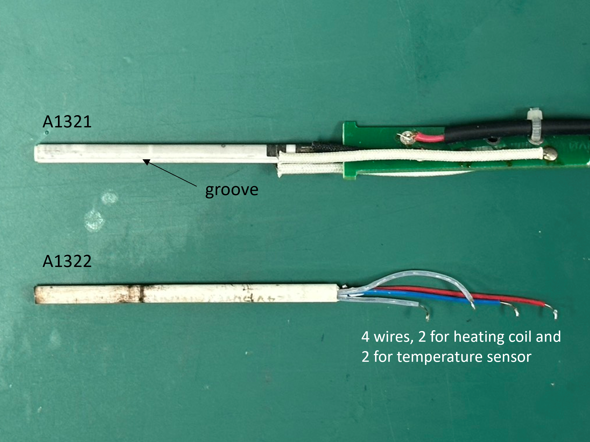

# Soldering Ceramic Heating Elements
The most common models of ceramic heating element used for temperature-controlled soldering iron are A1321 and A1322.
Both of these two heating elements feture with 4 wires (usually 2 long and 2 short).

The appearance of these two models of heating elements are **almost identical**. But one can identify them by the existance of a groove on the their body. A1321 fetures a **axial groove** alone with the ceramic body, while A1322 does not (Figure 1).

**Figure 1.** Appearance of A1321 and A1322 ceramic heating elements.

The 4 wires connected to the heating element serve as the **heating coil** and **temperature sensor**. One can identify the their functionality by measuring the resistance bwtween any pair of wires (refer to Table 1 for the value of resistance and corresponding functionality).

**Table 1.** Resistance of heating coil and temperature sensor for A1321 and A1322 ceramic heating element.
|       | Heating coil | Temperature sensor (at room temperature)                 |
|-------|--------------|----------------------------------------------------------|
| A1321 | 2.5~3.5 Ω    | 43~58 Ω, positive temperature coefficient (PTC) resistor |
| A1322 | 10~16 Ω      | 2~2.5 Ω, k-type thermal couple                           |

Note that as the sensor type is **different** for A1321 and A1322, therefore, these two models of heating elements **can not be replaced** by each other.