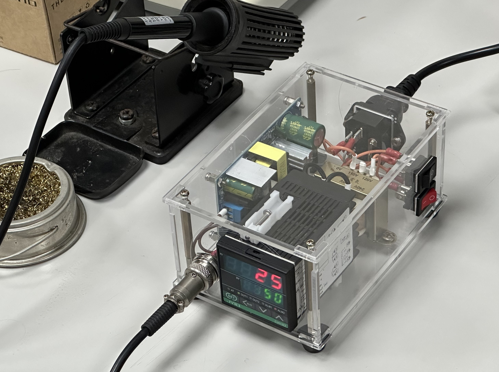
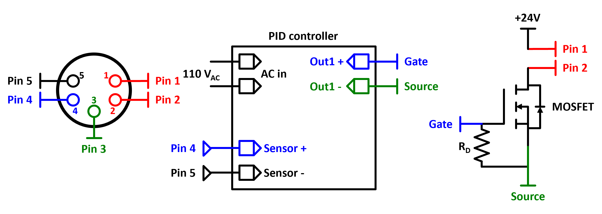

# Soldering station for A1321
# Soldering station for A1322
Because the A1322 heating elements use a build-in **K-type** thermalcouple as temperature sensor, I used a simple and basic PID temperature controller (CH102) to drive it. Here is the bill of major materials for me to build the controller:

**Table 2.** Major elements for building the soldering iron controller.
| Element     | Describe                              |
|-------------|---------------------------------------|
| CH102       | PID temperature controller            |
| AC-DC2403   | AC 110/220V to DC 24V / 70W converter |
| Transformer | AC 110V to AC 220V                    |

Here is the appearence of the soldering iron controller. Inside the acrylic box, I used a self-coupled transformer to transfer the AC 110V to AC 220V because the CH102 temperatured controller needed. Meanwhile, AC-DC2403 moudule transfers the AC 110V to DC 24V as the power source for heating element. As the CH102 controller features a build-in relay output, so I directly used the build-in relay to control the open/close state of heating circuit.

**Figure 2.** Assempled soldering iron controller for A1322 heating elements.

The wiring for soldering iron and CH102 controller is illustrated in Figure 3. Because the K-type thermalcouple is **polarity sensitive**, the connection of Pin 4 and Pin 5 **connot be reversed**. Otherwise, the read value of temperature change would be also reversed.

**Figure 3.** Wiring for soldering iron using A1322 heating element and PID temperature controller.